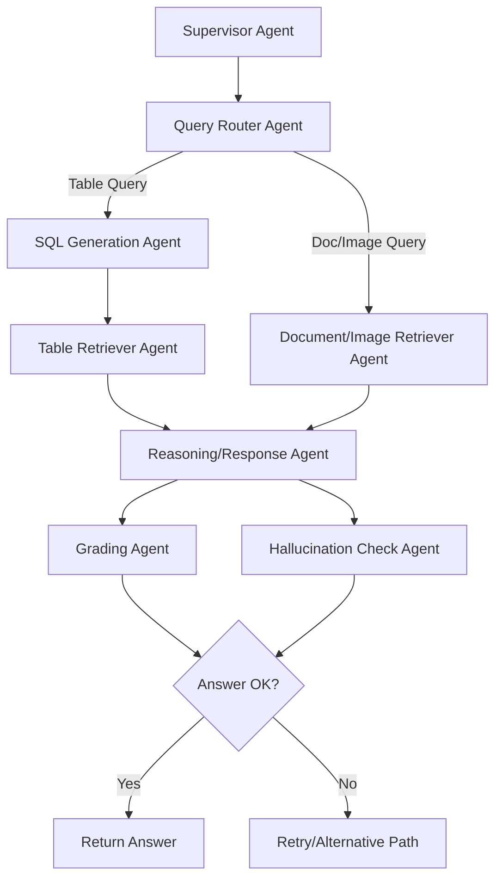

## ⬡ Agentic Multimodal RAG System

A deployable **Multimodal Retrieval-Augmented Generation** system that answers questions **strictly** from your uploaded documents. Runs locally or on HuggingFace Spaces.

## Features

| Feature | Details |
| --- | --- |
| 📄 **Document types** | PDF (text + embedded images), scanned images (OCR), XLSX, DOCX, CSV, TXT |
| 🌐 **URL indexing** | Paste any URL — crawls up to 2 levels deep (same domain, max 50 pages); linked PDFs downloaded and indexed automatically |
| 🔍 **Multimodal** | Extracts text, tables, charts, and images from PDFs |
| 🧠 **Strict grounding** | Answers ONLY from documents — responds "I DON'T KNOW" otherwise |
| 💾 **Persistent vector store** | ChromaDB with cosine similarity (persists across restarts) |
| ⚡ **LLM backends** | Groq (default on HF Space) → HF Inference (opt-in) → Ollama (local fallback) |
| 💬 **Conversation memory** | Remembers context; auto-summarizes when context window fills up |
| 📁 **Document management** | Add/remove documents and URLs via UI; files synced to HF Dataset for persistence |
| 🔊 **Text-to-Speech** | Read aloud any answer; works on desktop and mobile; tap again to stop |
| 💡 **Sample questions** | 12 one-click question chips for quick exploration |

## 🕸️ Agentic Workflow (LangGraph-style)



This diagram shows the modular agent workflow for query handling, retrieval, reasoning, grading, and hallucination checking.

## LLM Backend Priority

| Priority | Backend | Condition |
| --- | --- | --- |
| 1 | **Groq** (`llama-3.3-70b-versatile`) | `GROQ_API_KEY` is set |
| 2 | **HF Inference API** (`Llama-3.1-8B-Instruct`) | `USE_HF_LLM=1` + `HF_TOKEN` set |
| 3 | **Ollama** (`llama3.2`) | fallback / local dev |

## Setup

### Prerequisites

1. **Install Tesseract** (for OCR):
   - macOS: `brew install tesseract`
   - Ubuntu: `sudo apt-get install tesseract-ocr`
   - Windows: <https://github.com/UB-Mannheim/tesseract/wiki>
2. **For local Ollama fallback** — Install Ollama and run `ollama pull llama3.2`

### Installation

```bash
pip install -r requirements.txt
```

### Run

```bash
python app.py
```

- Gradio UI: <http://localhost:7860>
- FastAPI docs: <http://localhost:8000/docs>

## Environment Variables

| Variable | Default | Description |
| --- | --- | --- |
| `GROQ_API_KEY` | — | Groq API key (enables Groq backend, priority 1) |
| `USE_HF_LLM` | `0` | Set to `1` to use HF Inference API instead of Ollama |
| `HF_TOKEN` | — | HuggingFace token (required for dataset sync + HF Inference) |
| `HF_DATASET_REPO` | — | HF Dataset repo ID for persistent file storage (e.g. `user/repo`) |
| `DATA_DIR` | `./data` | Directory for uploaded documents |
| `VECTORSTORE_DIR` | `./vectorstore` | ChromaDB persistence directory |
| `OLLAMA_MODEL` | `llama3.2` | Ollama model to use (local fallback) |
| `API_BASE` | `http://localhost:8000` | FastAPI backend URL |

## Project Structure

```text
multimodal-rag/
├── app.py                   # Entrypoint (local dev + HuggingFace Spaces)
├── frontend.py              # Gradio UI
├── backend.py               # FastAPI backend
├── Dockerfile               # HF Spaces Docker build
├── deploy_changes.sh        # One-command deploy to GitHub + HF Space
├── requirements.txt
├── data/                    # Uploaded documents (synced to HF Dataset)
├── vectorstore/             # ChromaDB persistent storage
└── utils/
    ├── document_processor.py  # PDF/image/DOCX/XLSX extraction
    ├── url_processor.py       # Web crawler + linked PDF downloader
    ├── vector_store.py        # ChromaDB manager
    ├── rag_engine.py          # RAG + Groq/HF/Ollama integration
    └── memory.py              # Conversation memory manager
```

## API Endpoints

| Method | Endpoint | Description |
| --- | --- | --- |
| GET | `/status` | System status, indexed docs, chunk count |
| POST | `/documents/upload` | Upload and index a document |
| POST | `/documents/url` | Start background crawl of a URL (returns immediately) |
| GET | `/documents/url/status?url=` | Poll crawl job status (`crawling` / `done` / `error`) |
| DELETE | `/documents/{filename}` | Remove a document or URL from the index |
| DELETE | `/documents` | Remove ALL documents from index, disk, and HF Dataset |
| POST | `/query` | Query the RAG system |
| POST | `/memory/clear` | Clear conversation memory |
| GET | `/memory/stats` | Memory usage stats |

## HuggingFace Spaces Deployment

1. Set Space secrets: `GROQ_API_KEY`, `HF_TOKEN`, `HF_DATASET_REPO`
2. Deploy with:

```bash
./deploy_changes.sh
```

The script creates an orphan branch (no binary files in git history) and force-pushes it to the Space. Uploaded documents are persisted in the HF Dataset repo and re-downloaded on every container restart.

> **Note**: Binary files (PDFs, images, etc.) are stored in the HF Dataset, not in the Space git repo. This satisfies HF's Xet storage requirement for large files.
